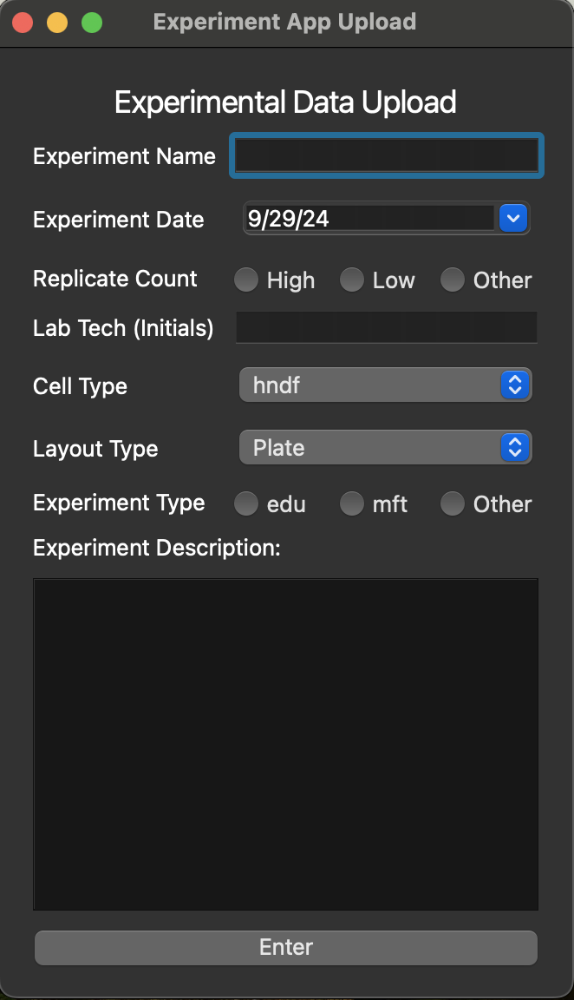
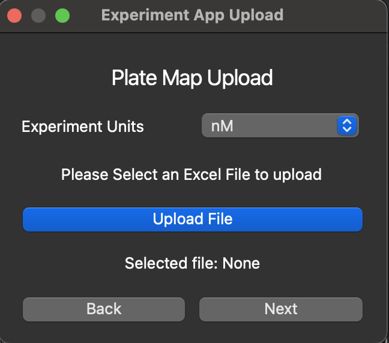

# Experiment Data Collection App

A desktop application designed to streamline the collection, parsing, and organization of experimental results for lab technicians. Built using PyQt6, this app makes data management seamless and scalable, with support for handling large datasets.

---

## 📜 Description

The **Experiment Data Collection App** is built to help lab technicians efficiently manage and process experimental results. The app allows users to upload large data files, organize them for easy access, and automate several repetitive tasks. It also ensures data integrity while offering a user-friendly interface.

---

## 🛠️ Technologies Used

- **Python**: Core programming language
- **Pandas**: For raw data parsing and management
- **PyQt6**: For building the user interface
- **Amazon S3**: For cloud storage integration
- **Boto3**: For AWS integration

---

## ✨ Features

- **Data Upload**: Bulk upload functionality for large experimental datasets.
- **Cloud Integration**: Store data on Amazon S3.
- **Automated Parsing**: Automatically parse and organize incoming data.
- **User-Friendly UI**: Built with PyQt6, the interface is designed for ease of use.
- **Cross-Platform**: Works on Windows, macOS, and Linux.

---

## 📸 Screenshots

*Here you can add images of your app in action, like so:*

---
